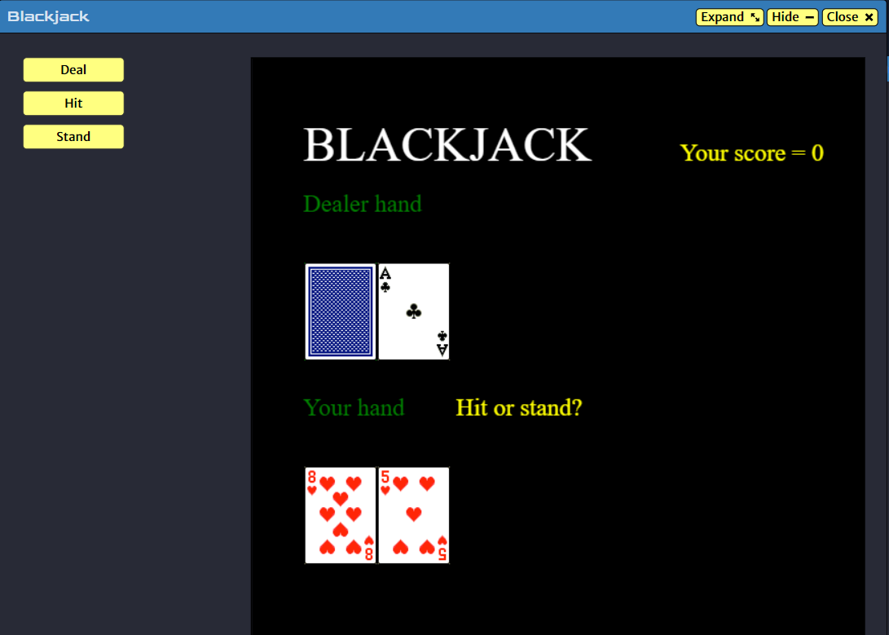
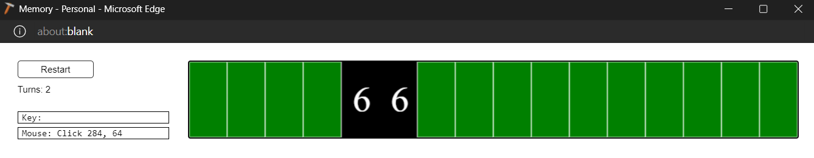
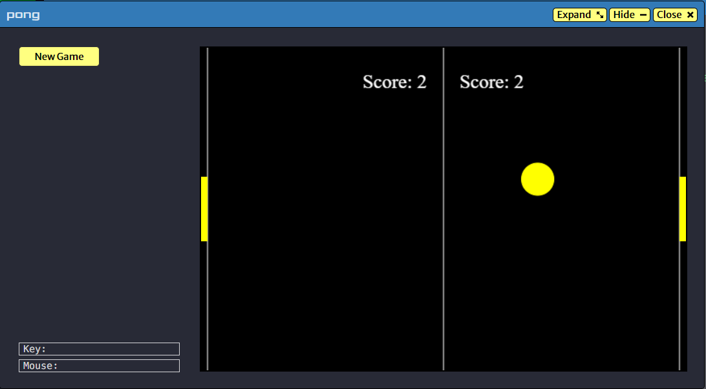
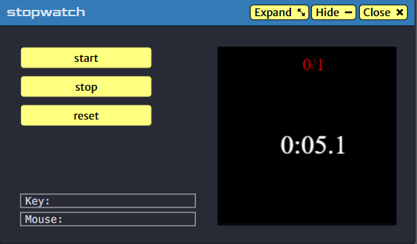
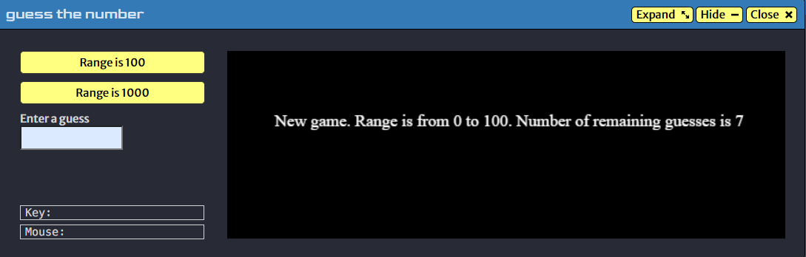
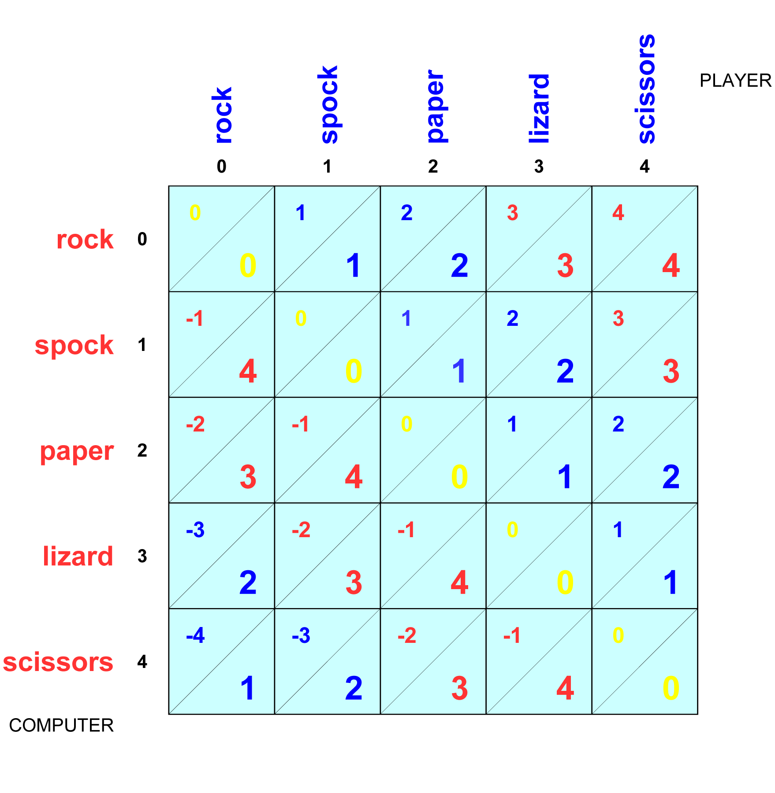
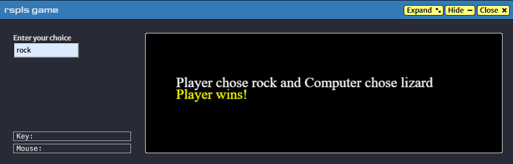

# Fun programming

**Hello from my keyboard!**

This repo is dedicated for my (nonsense) programs. Or, do make sense but not sellable haha :D

The existence of this repo is 1) for fun and 2) continuous learning. 

*Nothing helps you grow more than building something from scratch, big or small.*

## Blackjack game
This Blackjack game is a simplified version of the gamble you see in Las Vegas. 

Start a deal?

[Play game here](https://py2.codeskulptor.org/#user51_Hf5FIx2SrC_14.py)

If does not work, try open it from Chrome browser.

## Memory game
In "Memory" game, you'll check if you have a photographic memory. For each turn, you'll reveal 2 cards. If the cards are the same, the cards will stay exposed. But if the cards are different, they will be flipped. Try to see if you can expose all the cards with the smallest number of turns. 

Restart buttons will restart the game over with new spread (think about spreading a card deck, this works the same, card positions will be different).

[Play game here](https://py2.codeskulptor.org/#user51_Hf5FIx2SrC_14.py)

If does not work, try open it from Chrome browser.

## Arcade Pong game
In "Arcade Pong" game, you'll play with your friend. You all will try to move the your paddel to hit the ball. If you do not hit the ball when it comes, your opponent score 1 and you don't earn any.

The ball moves at random speed. And to make the game a bit more challenging, if any of you strike the ball, the speed will increase by 10%. 

Control key to move the paddles:
Left paddle: W to move up and S to move down
Right paddle: Up arrow to move up and down arrow to move down

[Play game here](https://py3.codeskulptor.org/#user309_YPR6SsMD1P_14.py)

If does not work, try open it from Chrome browser.
If keyboard isn't responsive, [try this URL instead](https://py2.codeskulptor.org/#user309_YPR6SsMD1P_14.py)

## Stop The Watch game
In "Stop the watch" game, you'll try to stop the watch at whole second. For example, if the watch stops at 0:05.0, you score 1. If not, you don't earn any score. 

The score is in "x/y" format, in which y is the number of times you hit the stop button, and x is your score. 

[Play game here](https://py3.codeskulptor.org/#user309_uGEW4OWIkr_4.py)

If does not work, try open it from Chrome browser.

## Guess The Number game
In "Guess the number" game, you'll play with computer.

Computer picks a secret number in a predefined range (range from 0 to 100 or range from 0 to 1000) and you'll guess what the number is. For each guess, computer will respond whether the number is higher, lower to the guess. If you guess the number right, you win, and new game will automatically start.

If you run out of guesses yet still not find the number, game is over. A new game will also automatically start.

[Play game here](https://py3.codeskulptor.org/#user309_p2lFVLUeqL_0.py)

If does not work, try open it from Chrome browser.

*Note*:
Strategy to guess the number: mimic the computer's "binary search" algorithm. Try to narrow the range each guess. With this strategy, you'll always find the number after n guess where 2^n >= the range.

## Rock Scissors Paper game
This game is a modified version of traditional Rock Scissors Paper game in which it has 5 choices in total: rock, scissors, paper, lizard, and Spock.

Game rule:
You play with computer

[Play game here](https://py3.codeskulptor.org/#user309_input_fields_3.py)

If does not work, try open it from Chrome browser.

